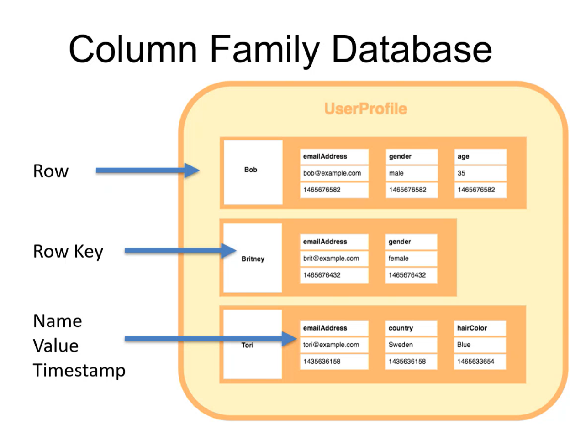
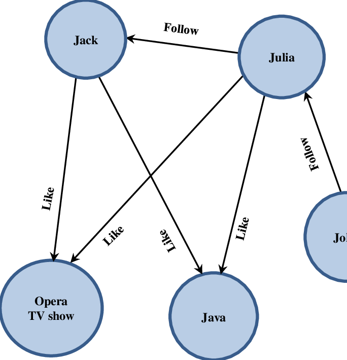

# Assessment on MongoDB

24 questions, all multiple choice, 65% pass mark, 60 minutes.

Will be done Monday morning **04th August 2025**.

Topics include:

## NoSQL database types

A database in NoSQL is a storage container which holds semi/ no structured data. This is good for flexibility, scalability and diverse demands.

Often times the data stored in this format is within a data warehouse or a data lake.


### Document database

In a document database the data is stored as a Json, Bson or XML file. They do not require a fixed schema.

Documents can be stored and retreived in a form closer to the data objects within the applications. This in turn means less translation is required when using the data.

To access the data we use index values this allows faster querying.

Within document databases are collections, a method of grouping documents together with similar contents or purposes. However, the documents within a collection do not require a fixed schema so they may have different fields and structures.

#### Key features

- Flexible schema: Data within a document can have a different number of rows and different fields. Although some can have schema validation.

- Document model: Documents map to objects using programming languages, allows faster applications.

- Each document handled is an individual object

- Distributed: Data is stored across different notes rather than a single machine.

- Json storage: Supports the storage of different data. We can have all the information that you need to access together (embedding) in one document or take the liberty of creating separate documents and then linking them (referencing).

- No foreign keys: No dynamic relationships between documents, so documents can be independent.

An example is MongoDB, content management.

#### Crude Operations

Document databases use either an API or query language to allow CRUD (Create, read, update and delete).

- Create: Documents can be created inside the database and will be set a unique identifier.

- Read: Documents can be read from the database. The API/ Query language allows documents to be queried using their unique identifiers or field values.

- Update: Documents can be updated in whole or part.

- Delete: Can delete documents from the database.

### KEY: Value stores

This is the simplest form of a NoSQL database. Every element is stored in key - value pairs. Similar to documents the data can be retrieved using a unique key allocatted to each element in the database.

This is very similar to a relational database as it has two columns the key and the value assigned.

#### Key features:

- Simplicity and speed: Data retreival is fast due to direct key access

- Scalability: Designed for horizontal scaling and distributed storage

- Ideal for caching and real time applications

An example is Amazon DynamoDB, cloud based scalable applications.

### Column family database

Data is stored in columns rather than rows.

When we want to run a small number of columns we can read those columns directly without consuming memory with unwanted data.

Column databases are designed to read data more efficiently and retrive data quickly.

- Used to store large amounts of data.



#### Key features

- High scalability: Supports distributed data processing.

### Graph store

A graph store database stores data as nodes (entities) and expresses their connections through edges (relationships) over tables.


### Nodes

- A label marks a node as a member, represents their different roles in a domain
- Hold multiple key- value pairs
- Be indexed, improving read function
- Bound by constratins

### Relationships

- Must have a start node, end node and one type
- show a direction
- Meaning over view

## Querying

## normalisation vs denormalisation

### Normalisation

Organise data so redundancy is minimised and data integrity is maintained by breaking down complex data into smaller collections to avoid duplicating information.

#### Advantages

- Data is reduced
- Optimised memory
- Maintain integrity

#### Disadvantages

- The number of tables is increased
- Consume more resources when using joins expensive operations

### Denormalisation

Data is combined to execute queries quickly.

#### Advantages

#### Disadvantages

## Database scaling

In mongoDB we use horizontal scaling, this allows us to share resources amongst multiple servers. Vertical scaling applies more resources.

Horizontal scaling is preferred as it is more secure.

## Relationships in Mongodb

Reminder MongoDB is a document NoSQL database! Therefore it uses embedding and referencing.

### Embedding

Embed sub-documents inside a larger document.

- One-to-one
- One-to-many

Good for denormalised data. Default method in MongoDB as it is good for read.

### Referencing

Seperate documents will be referenced here, this helps with redundacy but affects the read function.

- Many-to-many

Best for normalised data, will use an ID.

## Mongosh commands

(REFER to MONGOSH.md)

## Mongodb architecture

### Replica Sets

Several copies of the same data is held in multiple nodes. The primary node is the main source for all the writen operations. This is where all data modifications begin and are implemented initially.

Secondary node is a mirror of the primary node as it duplicates the data. This is used for dispersing the read workloads and load balancing.

### Sharding

Horizontal scaling is the core to sharding. Large datasets are divided into smaller pieces and distributed across multiple shards (servers).

Sharding helps with ensuring all the connections are still together through distributions across machines.

## .aggregate()

The aggregation pipeline is a READ ONLY default it allows us to view specific data in our collections.

It has a number of stages which appear in an array.

```
db.collection.aggregate( [ { <stage> }, ... ] )
```

**Little details**

- $set is an example of a stage in the aggregation pipeline

## `_id:` field

In MongoDB, each document stored in a standard collection requires a unique \_id field that acts as a primary key.

When using $group aggregate expression we can set a field to be the \_id value to group the data as so.
