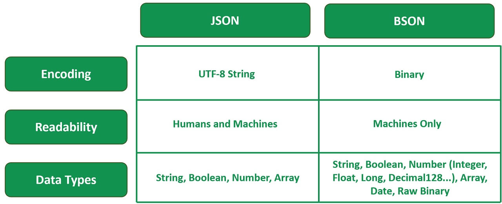
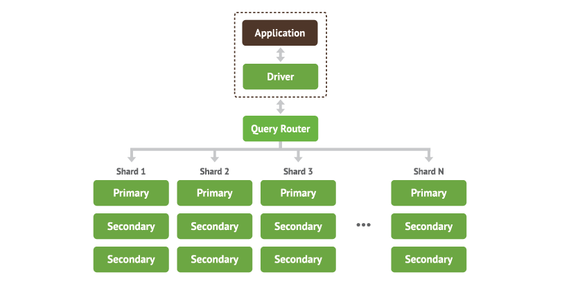
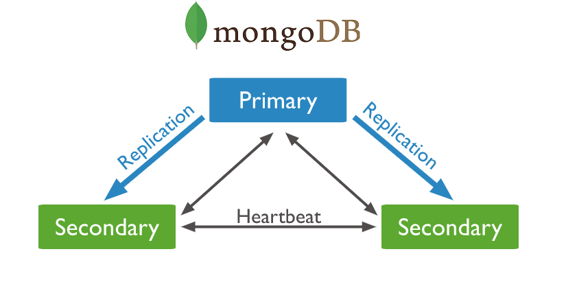
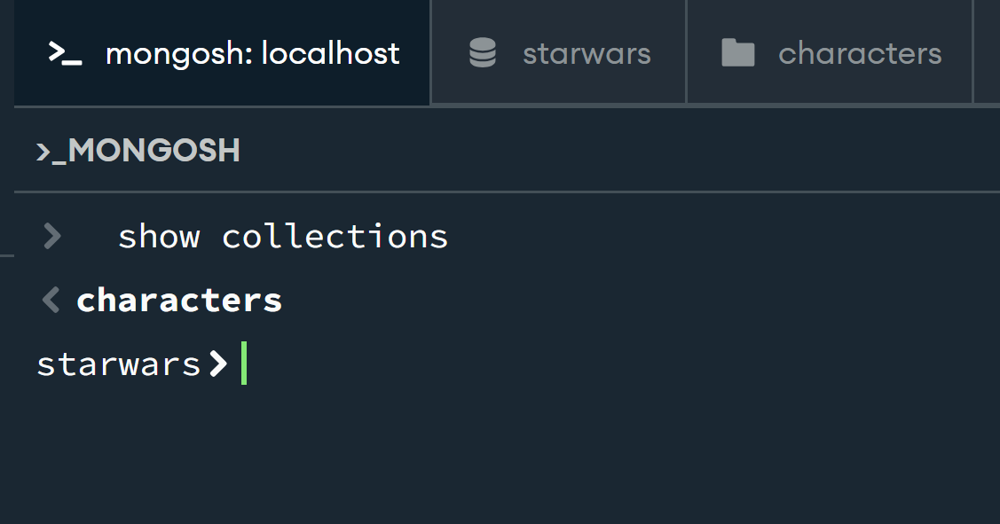

# MongoDB

MongoDB is an open source NOSQL database. This means it is **Not Only SQL**.

The data within MongoDB is inputted as Json like objects and stored within documents as Bson documents.



## Core concepts

### Collections

When we have multiple Bson Documents we are able to store them together in collections.

A database is able to store one or more collections of documents.


There is no real structure for a collection as they are schemaless.

### Documents

In mongoDB data is stored as Bson Documents.

Bson is a binary representation of a Json.

**Fun fact**: _The max size of a mongoDB document is 16mb._

### Node

A mongodb node is one server or machine in the database system.

### Mongod

#### (Not used yet)

A primary daemon (background) process and stores data on the disk. It handles:

- Data requests
- Manages data access
- Performs background operations

### MongoDB Shell

This is the shell used within MongoDB. It allows us to interact with MongoDB deployments in Atlas, locally or another remote host.

We mainly use it to test queries, make changes and interact with the data.

## Architecure

Occurs in the background, it is designed to be flexible.

### Sharding

**Horizontal scaling** is the core to sharding. Large datasets are divided into smaller pieces and distributed across multiple shards (servers).

Sharding helps with ensuring all the connections are still together through distributions across machines.



#### Advantages

- Improves performance
- Improves scalbaility in comparison to vetical scaling.

#### Disadvantages

- Increase complexity
- Operational overhead, backups, constant monitorisation and maintenance.

### Replica sets

Several copies of the same data is held in multiple nodes. The primary node is the main source for all the writen operations. This is where all data modifications begin and are implemented initially.

Secondary node is a mirror of the primary node as it duplicates the data. This is used for dispersing the read workloads and load balancing.



#### Advantages

- If any issues occur to a primary node the secondary node can take its place.

- Can write straight to the secondary node but not very common.

- Helps with redundancy.

#### Disadvantages

- Writing to the secondary node can cause data inconsistency.

## MongoDB Use cases

### Real time analytics

Aggregation framework and ability to scale horizontally, it is perfect for applications that require quick insights from large datasets.

**Example:**
MetLife uses MongoDB for 'The Wall', a customer service app that consolidates data from 70+ legacy systems.

Business can track user behaviour and make customer experiences better.

### Gaming applications

MongoDBs flexible schema allows dynamic content and real time updates which allows devs to change in game behaviour constantly.

**Example**:

EA, uses MongoDB to track user data and create personalised gaming. It allows the storing and processing of data to be conducted quickly.

## Interact with MongoDB

In order to interact with our MongoDB database we use MongoDB shell, known as MONGOSH.

## Establish relationships

### Embedding

Embed sub-documents inside a larger document.

This is good for:

- One-to-one
- One-to-many

Good for denormalised data. Default method in MongoDB as it is good for read.

### Referencing

Best for normalised data, will use an ID.

Seperate documents will be referenced here, this helps with redundacy but affects the read function.

This is good for:

- Many-to-many

### Collection Validations

When going over the validations of our collections we have the options to change the level for security purposes.

- Moderate will implemenet the rules for new entries.

- Strict will implement rules all the time.

## Data types

As MongoDB stores data using Bson, this allows the ability to store data types that arent available in Json.

## Date

Date can be stored as either a string or a Date object. This includes:

- Date() - A method which returns the current date as a string.
- new Date()- constructor which returns the date object in a wrapper
- ISODate()- constructor which returns the date object in a wrapper

### Double

MongoDB uses double over float

**Example:**

```
db.types.insertOne(
   {
      "_id": 2,
      "value": Double(1),
      "expectedType": "Double"
   }
)
```

### Number Long

A number long or number int will allow long numbers in MongoDB.

**Example:**

```
db.types.insertOne(
   {
      "_id": 3,
      "value": Long(1),
      "expectedType": "Long"
   }
)
```

## Functions used

### list collections

A shell command which will show a list of the collections within the database.

```
show collections
```



### Get collection names

A JavaScript function which return an array of the collection names in the current database.

```
db.getCollectionNames()
```

## Questions and solutions

### Find field

When inside the database we can search for specific fields and items through Mongosh.

```
db.characters.find({name: 'Luke Skywalker'},
{name: 1})
```

**Output:**

```
{
  _id: ObjectId('6888e7975b6d2a76fd6762dc'),
  name: 'Luke Skywalker'
}
```

### Find with further specifications

```
db.characters.find({name: 'Chewbacca'},
{'species.name': 1})

```

**Output:**

```
{
  _id: ObjectId('6888e7975b6d2a76fd6762f9'),
  species: {
    name: 'Wookiee'
  }
}
```

### Filter find

```
db.characters.find({eye_color:
    {$in:
        ['yellow', 'orange']
    }
 },
    {name: 1}
)
```

**Output:**

** Multiple Object \_ids and names belonging to the entries which hit the fields wants **

### Use $and and/or $or to find:

#### 1. Female characters with blue eyes and Male characters with yellow eyes

```
db.characters.find({$or:
        [
            {$and:
                [{gender: 'female'},
                    { eye_color: 'blue' } ] },
                    { $and: [ { gender: 'male' },
                    { eye_color: 'yellow' }
                ]
            }
        ]
    }
)
```

**Output:**
** Documents matching with the parameters**

### Do some research and see if you can find how to convert all the height strings to integers. Change null results.

```
db.characters.updateMany(
  {height: "unknown"},
    {$unset: {height: ""}})
    db.characters.updateMany(
    {},
        [{$set: {height:
            {$toInt: "$height"}}
        }
  ]
)
```

## MongoDB operators

### $eq

This is the equality condition. While other programming languages will use = as an operator mongoDB replaces this with **$eq**.

**Example**

```
    {<field>: {$eq: <values>}}
```

If the <value> is an array, it matches documents where the <field> matches the array or the <field> contains an element that matches the array exactly.

### $gt

Selects those documents where the values of the spcified field is greater than. While other programming languages will use > as an operator mongoDB replaces this with **$gt**.

**Example**

```
{ field:
    { $gt: value }
}
```

### $gte

Selects the documents where the value of the specified field is greater than or equal to. While other programming languages will use >= as an operator mongoDB replaces this with **$gte**.

```
{ field:
    { $gte: value }
}
```

### $in

This operator selects the documents where the value of a field equals any value in the specified array.

```
{ field:
    { $in: [<value1>,       <value2>, ... <valueN>
    ] }
}
```

### $lt

Comparison between two values and returns a boolean.

```
{ $lt:
 [ <expression1>, <expression2> ]
  }
```

### $lte

Selects the documents where the values of the field is less than or equal to. While other programming languages will use <= as an operator mongoDB replaces this with **$lte**.

```
db.inventory.updateMany(
   { "carrier.fee":
    { $lte: 5 } },
        { $set:
        { price: 9.99
        }
    }
)
```

### $ne

Selects documents where the value of the specified field is not equal to the specified value. Includes documents not containing the specified field.

```
{ field:
    { $ne: value
    }
}
```

### $nin

Selects the documents where the specified field value doesnt exist.

```
{ field:
    { $nin: [ <value1>, <value2> ... <valueN>
] } }
```

## Change mass to double

db.characters.update(
{mass: "1,358"},
{$set: {mass: "1358"}}
)

db.characters.update(
{mass: "unknown"},
{$unset: {mass: ""}},
{multi: true}
)

db.characters.update(
{mass: {$exists: true}},
  [{$set: {mass: {$toDouble: "$mass"}}}],
{multi: true}
)

##change datatype and remove nulls

db.characters.updateMany(
{height: "unknown"},
{$unset: {height: ""}}
)
db.characters.updateMany(
  {},
  [{$set: {height: {$toInt: "$height"}}}]
)

# Aggregation in MongoDB

```
db.characters.aggregate([
    {$match:
        {"species.name": "Human"}},
        {$group:
            {_id: null, total:
            {$sum:"$hieght"}

        }}
])
```

Null is used when we dont want to group them by anything in the \_id sections.

```
db.characters.aggregate([
{ $group: {_id: "$homeworld.name", max: {$max: "$height"}}}

])
```

## Single purpose aggregation

distinct
count
db.characters.distinct("species.name")

With .agreggate mongoDB doesnt show all results, only the top 10.

db.characters.aggregate([
{
$group: {
_id: "$species.name",
avg: {$avg: "$mass"},
count: {$sum: 1}
}
}, { $match: {avg: {$ne: null}}},
{$sort: {avg: 1}}
]).toArray

# Reference

Assign people to the starship

db.characters.find({name: "Darth Vader"}, {\_id: 1})

### Create a collection

Collection called starships

db.createCollection("starships")

db.starships.insertOne({
replace the objectID with the one given!!
})

##Code
This will give you both the initial object and the referenced object (through lookup)

db.starships.aggregate([
{$lookup:{
from: "characters",
localField: "pilot",
foreignField: "\_id",
as: "matched_pilot"
}}

])
Better than embedding as this gives you results from more than one.

##Code here is together

### Get object id

db.characters.find({name: {$in: ["Chewbacca", "Han Solo", "Lando Calrissian", "Nien Nunb"]}}, {\_id: 1})

# Questions

when to use {}
when to use $
when to use []
